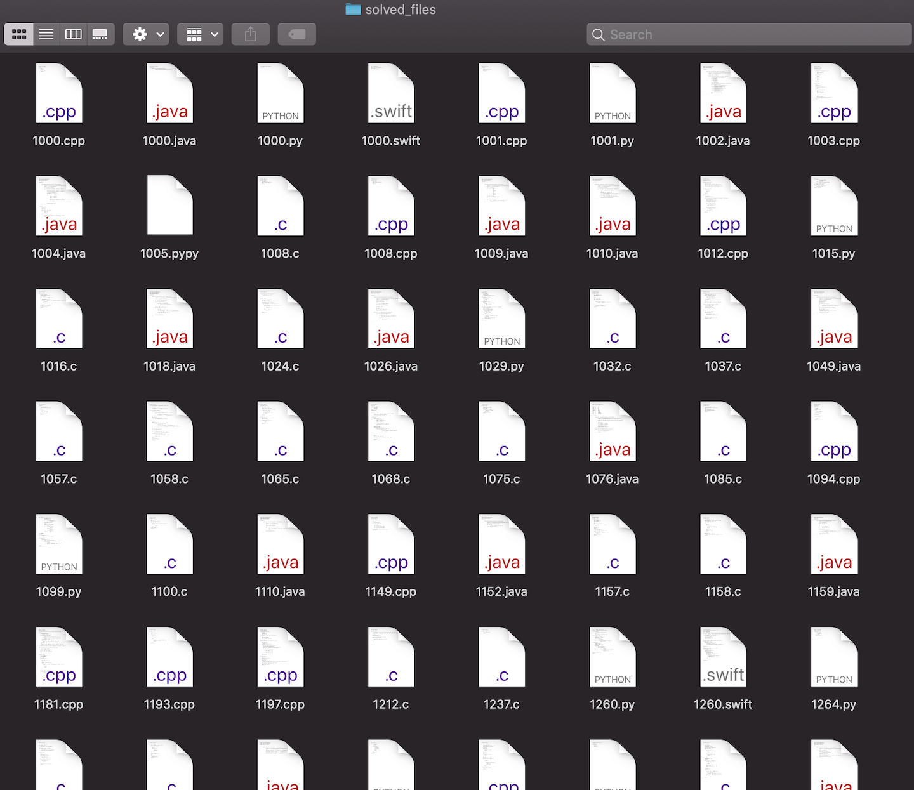

# BOJ to File

### STEP

- Run 'main.py'
- Login BOJ manually
- Wait for loading
- TADA @_@

### Copy your BOJ Code to your PC

------

## You should install these module
- bs4
- selenium

## You should set these things
- Make sure 'driver/chromedriver' version is equal with your chrome version. And OS also.
- <s>Create 'me.key' text file on root folder. And put your BOJ ID in first line and PW in second line.</s>

> If you do these upper things, just run 'main.py' 